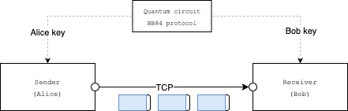

This folder contains a simple demonstration of BB84 quantum key exchange in conjunction with traditional socket data exchange. In the example, sender is trying to send a simple file to receiver in chunks of data which are encypted by the current key. They key id is transmitted along with the chunk. The keys are delivered directly to sender and receiver by key mgmt layer that includes quantum bit. 

