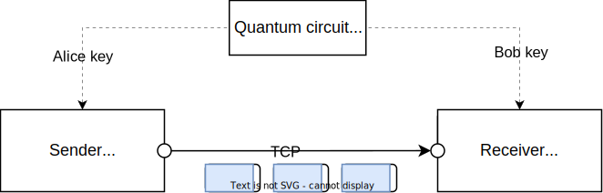

This folder contains a simple demonstration of BB84 quantum key exchange in conjunction with traditional socket data exchange. Here are some quick points below about it.  

- sender is trying to send a simple file to receiver over tcp sockets, in chunks of data which are encypted by the current key. 
- The key is rotated every 1s or configured amount in ipynb file as many times configured. 
- key id is transmitted along with the chunk of data indicating the key receiver should use to decrypt. 
- keys are delivered directly to sender and receiver by key mgmt layer that includes quantum bit. 
- Server annd client are written in rust.

